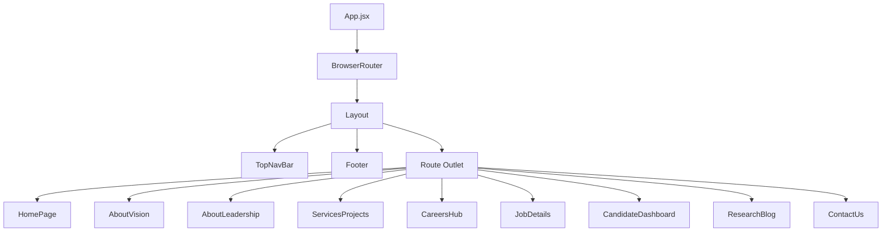

<p align="center">
  
</p>

<h1 align="center">🔬 LoopLab — Corporate Web Platform</h1>

<p align="center">
  <strong>A premium, design-driven corporate website built with React, Vite, and Tailwind CSS.</strong><br/>
  Inspired by the <em>"Ethereal Core"</em> design philosophy — where precision-milled glass meets digital artistry.
</p>

<p align="center">
  
  
  
  
  
</p>

---

## ✨ Overview

LoopLab is a fully responsive, multi-page corporate web platform for a next-generation technology company specializing in **AI systems**, **software architecture**, and **data-driven agriculture solutions**. Every pixel follows the internal **"Ethereal Core"** design system — emphasizing kinetic depth, editorial typography, glassmorphism, and tonal layering over conventional borders and shadows.

### 🎯 Key Highlights

- **9 fully designed pages** with seamless client-side navigation
- **Custom Material Design 3 color system** with 50+ semantic tokens
- **Dual-typeface system** — Space Grotesk (headlines) + Manrope (body)
- **Glassmorphism & ambient shadows** throughout the UI
- **Zero 1px borders** — hierarchy achieved through tonal shifts
- **Mobile-responsive** layouts across all breakpoints
- **Google Material Symbols** icon integration

---

## 🗂️ Project Structure

```
looplab-app/
├── public/                    # Static assets
├── src/
│   ├── components/
│   │   └── Layout.jsx         # Global nav + footer shell
│   ├── pages/
│   │   ├── HomePage.jsx       # Landing page with hero & bento grid
│   │   ├── AboutVision.jsx    # Company vision, mission & leadership
│   │   ├── AboutLeadership.jsx# Extended leadership with glass cards
│   │   ├── ServicesProjects.jsx# Services bento + project case studies
│   │   ├── CareersHub.jsx     # Job listings, filters & CV submission
│   │   ├── JobDetails.jsx     # Individual job posting detail view
│   │   ├── CandidateDashboard.jsx # Authenticated candidate portal
│   │   ├── ResearchBlog.jsx   # Blog grid with featured article
│   │   └── ContactUs.jsx      # Contact form with map section
│   ├── App.jsx                # Router configuration
│   ├── main.jsx               # React entry point
│   └── index.css              # Global styles & Tailwind directives
├── index.html                 # HTML shell with font preloads
├── tailwind.config.js         # Extended theme with full color system
├── postcss.config.js          # PostCSS pipeline
├── vite.config.js             # Vite build configuration
└── package.json
```

---

## 🚀 Pages & Routes

| Route | Page | Description |
|:------|:-----|:------------|
| `/` | **Home** | Hero section, core competencies bento grid, agriculture impact, careers CTA |
| `/about` | **About — Vision** | Company legacy hero, mission/vision cards, stats, leadership grid, social impact |
| `/about/leadership` | **About — Leadership** | Extended team profiles with glassmorphism cards and bios |
| `/services` | **Services & Projects** | Services bento grid, AI/Data/Dev/Marketing cards, project case studies |
| `/careers` | **Careers Hub** | Job search & filters, job listing cards, CV upload sidebar form |
| `/careers/job-details` | **Job Details** | Full job posting with role details, requirements, perks, application CTA |
| `/candidate-dashboard` | **Candidate Dashboard** | Sidebar navigation, stats bento, notifications, profile, CV manager, application history |
| `/blog` | **Research Blog** | Featured article, category filters, article grid, newsletter subscription |
| `/contact` | **Contact Us** | Contact info cards, contact form, interactive map section |

---

## 🎨 Design System — "The Ethereal Core"

The design system is documented in [`stitch/prism_logic/DESIGN.md`](../stitch/prism_logic/DESIGN.md) and enforces:

### Color Philosophy
| Token | Hex | Usage |
|:------|:----|:------|
| `primary` | `#613380` | Main brand purple — CTAs, accents |
| `primary-container` | `#7a4b9a` | Gradient endpoints, containers |
| `secondary` | `#3c6184` | Supporting blue — secondary actions |
| `surface` | `#f7f9ff` | Primary canvas background |
| `surface-container-low` | `#f0f4fb` | Section backgrounds |
| `surface-container-lowest` | `#ffffff` | Card surfaces |
| `on-surface` | `#171c21` | Primary text (never #000000) |
| `outline-variant` | `#cec3d0` | Ghost borders at 15% opacity |

### Typography
| Style | Font | Size | Use |
|:------|:-----|:-----|:----|
| Display | Space Grotesk | 3.5rem–4.5rem | Hero headlines |
| Headline | Space Grotesk | 1.5rem–3rem | Section titles |
| Body | Manrope | 0.875rem–1.25rem | Paragraphs, descriptions |
| Label | Manrope | 0.625rem–0.875rem | Buttons, tags, metadata |

### Custom Utilities
```css
.hero-gradient      /* 135° from #613380 → #7a4b9a */
.glass-effect       /* 24px backdrop blur */
.glass-nav          /* White/60% + 24px blur */
.glass-card         /* White/70% + 12px blur + white border */
.ambient-shadow     /* 40-60px blur, 4-8% opacity */
.text-glow          /* Purple text shadow */
```

---

## 🛠️ Tech Stack

| Technology | Version | Purpose |
|:-----------|:--------|:--------|
| **React** | 19.2 | Component-based UI framework |
| **Vite** | 8.0 | Lightning-fast dev server & bundler |
| **React Router** | 7.13 | Client-side routing & navigation |
| **Tailwind CSS** | 3.4 | Utility-first CSS with custom theme |
| **PostCSS** | 8.5 | CSS transformation pipeline |
| **Autoprefixer** | 10.4 | Cross-browser compatibility |
| **ESLint** | 9.39 | Code quality & linting |

### External Resources
- **Google Fonts** — Space Grotesk, Manrope
- **Material Symbols Outlined** — Variable icon font
- **Hosted Images** — Google Cloud static assets

---

## ⚡ Getting Started

### Prerequisites

- **Node.js** ≥ 18.x
- **npm** ≥ 9.x

### Installation

```bash
# Clone the repository
git clone <repository-url>
cd looplab-app

# Install dependencies
npm install
```

### Development

```bash
# Start the dev server
npm run dev

# App will be available at:
# → http://localhost:5173/
```

### Production Build

```bash
# Create optimized production build
npm run build

# Preview the production build locally
npm run preview
```

### Linting

```bash
# Run ESLint
npm run lint
```
```bash
# Push changes to main branch
git add .
git commit -m "Your comment"
git push origin main
```
---

## 📱 Responsive Design

All pages are fully responsive with breakpoint-optimized layouts:

| Breakpoint | Width | Layout |
|:-----------|:------|:-------|
| **Mobile** | < 768px | Single column, stacked sections |
| **Tablet** | 768px – 1024px | 2-column grids, condensed nav |
| **Desktop** | > 1024px | Full multi-column layouts, sidebars |

The **Candidate Dashboard** uses a fixed sidebar layout optimized for desktop usage.

---

## 🧩 Component Architecture



> **Note:** The `CandidateDashboard` page has its own sidebar navigation and hides the global nav/footer for a full-app dashboard experience.

---

## 📄 Available Scripts

| Command | Description |
|:--------|:------------|
| `npm run dev` | Start Vite dev server with HMR |
| `npm run build` | Bundle for production |
| `npm run preview` | Preview production build |
| `npm run lint` | Run ESLint checks |

---

## 🏗️ Design Decisions

1. **No CDN Tailwind** — Uses a proper PostCSS pipeline with a custom `tailwind.config.js` for production-ready builds
2. **Layout-based routing** — Shared `Layout.jsx` wraps all pages with consistent nav/footer, except the dashboard
3. **Data-driven components** — Leadership profiles, job cards, and blog articles are rendered from arrays for maintainability
4. **Image hosting** — All images are served from Google Cloud static URLs matching the original Stitch designs
5. **Semantic color tokens** — 50+ Material Design 3 tokens ensure consistent theming and future dark mode support

---

## 📜 License

This project is **private and proprietary**. © 2024 LoopLab Corporate. All rights reserved.

---

<p align="center">
  <sub>Precision in every cycle. ✦ Built with the Ethereal Core design system.</sub>
</p>
